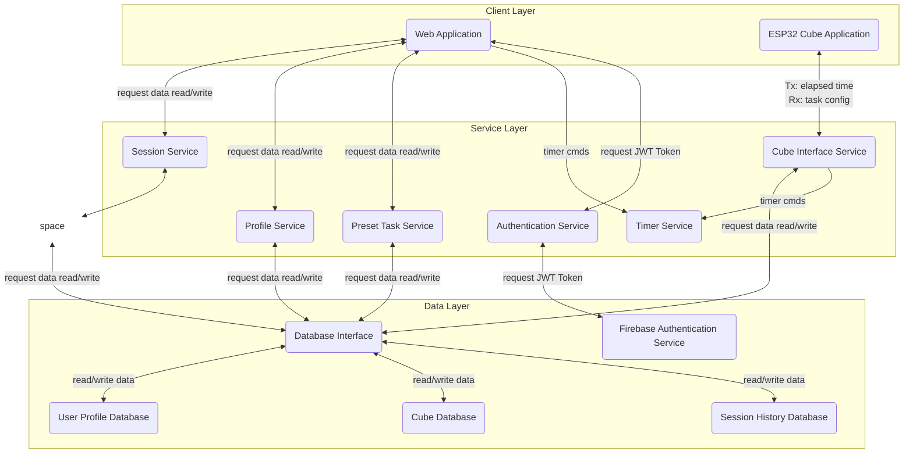

# Breathing Cube
In today’s digital world, attention is constantly fragmented. Smartphones, notifications, social media feeds, and endless scrolling compete for our focus every minute of the day. The result is chronic distraction, diminished deep focus, and elevated stress levels.

Now imagine being able to step away from that noise, even for a few minutes, and reconnect with your breath.

The BreathingCube is an IoT-enabled device designed to help individuals integrate meditation into busy daily life. Through guided ambient lighting patterns and subtle sound cues, it encourages intentional breathing and mindfulness practice, helping calm the nervous system and restore a sense of presence.

### Course: 
COMP 7855 Software Systems
### Status: 
In Development

## Features 
### Musts
- Press to Meditate
- Web App Control of Cube
- Customizable Colors
- Customizable Breathing Patterns
- Customizable Times

### Shoulds
- Meditation Time/Date Tracking
- Store Previous Session information

### Coulds
- Server Hosted Web App Accessible Online
- Colors Change Based on Time of Day
- Store Data Based on User

### Won'ts
- Synchronized LED animation to music

## About
This is application/product project for a meditation cube.
- Modular Design
- Network Communication
- Security Fundamentals

**Team Members:**
1. Parry Zhuo (Primary Owner)
2. Sasha Roosen-Saba
3. Bryce Reid
4. Kale Wyse

## Architecture
Below is a block diagram showing system components and data flow.



## Docker Quickstart Instructions

1. Use requirements.txt to manage the dependencies required to run the application:
    ```bash
   pip install -r requirements.txt
   ```
2. Generate a new private serviceAccountKey.json file from your Firebase project settings and include the file in the root project directory.
3. Use the .env.example file and Environment Variables documentation below to set up the local python environment.
4. Ensure Docker Desktop is installed and running:
   - Download from https://www.docker.com/products/docker-desktop
   - Verify with: `docker --version`
5. Build and start the Docker containers:
   ```bash
   docker compose up --build
   ```
6. Stop the Docker containers with `Ctrl+C` or:
   ```bash
   docker compose down
   ```

## API Specifications

| Method                    | Route                           | Description                                                             | Auth Required |
|---------------------------|---------------------------------|-------------------------------------------------------------------------|---------------|
| api_task_control          | /api/task/control               | Interface between hardware cube, Firestore database, and timer service. | CUBE_API_KEY  |
| api_get_profile           | /api/profile                    | Get all the current user's profile data.                                | JWT Token     |
| api_get_user_info         | /api/profile/user_info/<field>  | Get the user's user information. (ie. first_name, last_name, etc.)      | JWT Token     |
| api_update_user_info      | /api/profile/user_info          | Update user information. (ie. first_name, last_name, etc.)              | JWT Token     |
| api_save_cube             | /api/profile/cube               | Register a CUBE UUID with a user account.                               | JWT Token     |
| api_get_preset            | /api/profile/preset/<task_name> | Get preset task configurations.                                         | JWT Token     |
| api_create_preset         | /api/profile/preset             | Create new preset task configuration.                                   | JWT Token     |
| api_update_preset         | /api/profile/preset             | Update preset task configuration.                                       | JWT Token     |
| api_delete_preset         | /api/profile/preset             | Delete preset task configuration.                                       | JWT Token     |
| api_get_task              | /api/task/current               | Get the current active task name.                                       | JWT Token     |
| api_set_task              | /api/task/current               | Set the current active task.                                            | JWT Token     |
| api_get_latest_session    | /api/sessions/latest            | Get the latest session data form the session history database.          | JWT Token     |
| api_get_sessions          | /api/sessions                   | Get paginated session list for a user.                                  | JWT Token     |
| api_get_sessions_range    | /api/sessions/range             | Get sessions within a date range.                                       | JWT Token     |
| api_get_sessions_calendar | /api/sessions/calendar          | Get session data aggregated by day for calendar heatmap.                | JWT Token     |
| api_reset_timer           | /api/timer/reset                | Reset web timer to selected preset task time.                           | JWT Token     |
| api_login                 | /login                          | JSON API endpoint for login. Returns a JWT token.                       | None          |
| api_signup                | /signup                         | JSON API endpoint for new user registration.                            | None          |

## Environment Variables

Below are detailed descriptions of the environment variable required to implement this application.
A .env.example file is included as a template to help developers create the required .env file.

| Variable                 | Description                                                | Options                                 |
|--------------------------|------------------------------------------------------------|-----------------------------------------|
| FLASK_SECRET_KEY         | SECRET_KEY is used to sign session tokens and CSRF tokens. | None                                    |
| FIREBASE_WEB_API_KEY     | Firebase Web API Key for client authentication.            | None                                    |
| FIREBASE_SERVICE_ACCOUNT | Path to Firebase service account key file (for admin SDK). | None                                    |
| FIREBASE_PROJECT_ID      | Firebase Project ID.                                       | None                                    |
| CUBE_API_KEY             | API key for ESP32 CUBE device authentication.              | None                                    |
| APP_TYPE                 | Application type - determines which routes are registered. | web (all routes), api (API routes only) |
| FLASK_ENV                | Flask environment mode.                                    | development, production                 |
| LOG_LEVEL                | Log level - controls verbosity.                            | DEBUG, INFO, WARNING, ERROR, CRITICAL   |
| INTERNAL_SHARED_SECRET   | Shared secret securing API→web internal timer callbacks.   | None                                    |
| WEB_INTERNAL_URL         | API container URL to reach web container internally.       | e.g. http://127.0.0.1:5000              |
