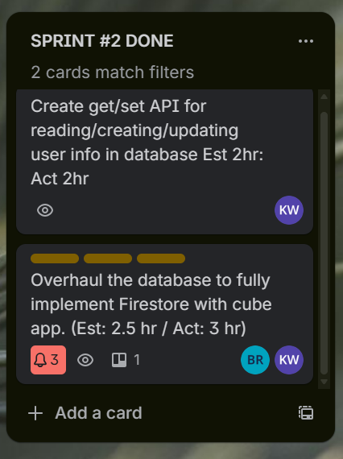

# Sprint 2 Report


---

## 1. Sprint Overview

- **Your Team Name:** [**Team 2**]  
- **Sprint 2 Dates:** [**10/02/2026 → 03/03/2026**]  
- **Sprint Goals:** 
    - *Implement feature dashboard connection for timer implementation with **Firestore persistence** and **safe validation**. data should be personal to each user and users should be able to login via email.*
    - *Create CUBE Client simulator to test and demo hardware REST API*
    - *Implement basic communication between ESP32 and FLASK SERVER using REST API*

---

## 2. Sprint Board

**Sprint Board Link:** [**[Trello](https://trello.com/invite/b/697954d1883f9190e1c7a774/ATTIfb7fe3865b854744cbb2eac186a07e0aE569C07D/7855202610-3)**]  
**GitHub Repository Link:** [[**Github**](https://github.com/BrycesDevices/7855_202610_03.git)]

---

### 2.1 Sprint Board Screenshot (Filtered by Team Member)

**Please provide a screenshot of your Sprint 2 board** (e.g., Trello, GitHub Projects) **filtered by each team member**. This makes the review concrete and shows shared ownership.

- **[Sasha Roosen-Saba] Board Screenshot:**  
  

- **[Bryce Reid] Board Screenshot:**  
  

- **[Perry Zhuo] Board Screenshot:**  
  
  
- **[Kale Wyse] Board Screenshot:**  


---

### 2.2 Completed vs. Not Completed (Feature-Focused)

**Plan** 


SPRINT 2:

- Web UI framework placeholders
- communication protocol between server + cube
(or mock cube client)
- **DATABASE FRAMEWORK** - Ability to store necessary data on firebase securely
- **Cube-Client Control** - Ability to start, stop, & reset sessions and send session information to the server for storage
- **Web-Client Control** - Ability to select the current active task, create new tasks, and edit preset task times
- **USER STORIES FOR BASIC FUNCTIONALITY** 
	- As a user i want the cube to send start, stop, and reset signals to the web app so that the app accurately tracks how long a cube has actively run a session. 
	- As a user i want to the web app to send session time to the cube. So that session time can be easily changed.
- **END-TO-END FEATURES**
	- 
    - Web app knows how long cube has run for. 
	- Web app can configure task times


**Completed in Sprint 2 (Feature)**

- [ ] **Web UI framework placeholders**
- [ ] **Cube-Client control** can trigger start stops and resets. 
- [ ] **Web-Client control** exposes the endpoint with basic validation
- [ ] **Database framework** integration: data is written to the database
- [ ] **Server** can retrieve the stored data (GET from Firestore)


## 3. Technical Summary: What Was Implemented

This is a **short technical summary** of the **end-to-end feature** you built.


### Communication between REST API on ESP32 with TEST FLASK SERVER

https://www.youtube.com/shorts/B0Q0dJrN8rY

### Defined basic JSON payload required from CUBE

TENTATIVE GET COMMAND


TENTATIVE POST COMMAND


- **Feature:** **Cube Client Simulator - Start Task**
- **Collection:** N/A  
- **What it does:** Triggers server to start timer for web app display


- **Feature:** **Cube Client Simulator - Stop Task**
- **Collection:** user_profiles -> uid -> session_history -> task_name & elapsed_time
- **What it does:** Triggers server to stop timer for web app display. 
Sends elapsed time recorded on the client to the server to store in database.


- **Feature:** **Cube Client Simulator - Reset Task**
- **Collection:** user_profiles -> uid -> current_task
- **What it does:** Triggers server to reset timer for web app display. 
Requests current task data from the server.


- **Feature:** **Web App - Set Current Task**
- **Collection:** user_profiles -> uid -> current_task
- **What it does:** Triggers server to update the current task in the database. 


- **Feature:** **Web App - Create Preset Task**
- **Collection:** user_profiles -> uid -> presets -> task_name -> task_color & task_time
- **What it does:** Triggers server to create a new task preset with the input task name (task_time default to 10 min & task_color default to #ffaa00) in the database. 


- **Feature:** **Web App - Update Current Task Time**
- **Collection:** user_profiles -> uid -> presets -> task_name -> task_time
- **What it does:** Triggers server to update the task time field in the current task preset in the database. 


- **Feature:** **Web App - Display Timer**
- **Collection:** user_profiles -> uid -> presets -> task_name -> task_time
- **What it does:** Web app displays the task time associated with the current task.
Display timer is controlled by CUBE client start, stop, & reset signals.


- **Feature:** [**Cube Timer Control**]  
- **Collection:** [**Firestore collection**] (e.g., `features`, `orders`, etc.)  
- **What it does:** [1–2 sentence description]

### Data Model (Firestore)

- **Document shape:**  
  Example JSON that represents **one document** in the collection (or the schema you structured):

  ```json
  {
    "current_task": "Study",
    "presets": {
      "Flow State": {
        "task_color": "#ffaa00",
        "task_time": 2100
      },
      "Meditation": {
        "task_color": "#ffaa00",
        "task_time": 3355
      },
      "Relax": {
        "task_color": "#ffaa00",
        "task_time": 900
      },
      "Study": {
        "task_color": "#ffaa00",
        "task_time": 600
      }
    },
    "session_history": {
      "elapsed_time": 8,
      "task": "Flow State"
    },
    "user_info": {
      "email": "bryceroberttaylorreid@gmail.com",
      "first_name": "Bryce",
      "last_name": "Reid",
      "role": "user"
    }
  }
  ```

  **Why this structure?** We used Firebase Authentication to validate users via email. Then with unique generated uuids we store the information we need. For basica usage we store preset tasks, connected cubes, current session, and session history. 

- **Input (Client → Server):**  
  Example JSON the CUBE client sends:

  ```json
    {
      "action": "stop",
      "elapsed_seconds": self.elapsed_seconds
    }
  ```
  
    Example JSON the Web client sends:

  ```json
    {
      "task_name": "chill time", 
      "task_time": 600, 
      "task_color": "#ffaa00"
    }
  ```

- **Output (Server → Client):**  
  Example response the CUBE client receives after a successful create or read:

  ```json
  {
    "message": "Meditation task reset", 
    "task_name": "Meditation", 
    "task_time": 3355
  }
  ```
  


---

## 4. End-to-End Flow (What Was Demoed)

**Every JSON request from the cube client is accompanied by the cube 
UUID to link the session activity to a particular user profile.**

**This is a brief description of the Cube client interacting with the server to start a task session**
1. **Client** cube sends a reset request (e.g., POST `/feature`) with a valid **payload** (JSON).
2. **Server** responds with a json with the current time and current task information
3. **Client** Displays current task via GUI
4. **Client** Start button is pressed on client GUI which sends a start task request to the server and Client starts a timer to measure time elapsed along with displaying the task has begun via a faux LED in the GUI.
5. **Server** Once server receives a start task, the server starts a timer to measure elapsed time for web-app display and returns a json to the client that the task has started.
6. **Client** Once client elapsed timer = the task_preset time an 'alert!' is displayed via the GUI.
7. **Client** Once the stop button is pressed the client checks if a task is running (client does nothing if task has not been started) and sends a json stop request to the server which has the elapsed time within the json payload.
8. **Server** Server sends a json POST request to the database with the task_name and elapsed time which is saved in latest session database.

**This is a brief description of the Web-app client interacting with the server to change the current task**
1. **Client** On the web-app client the user selects a different task from the drop down menu this sends a POST with a valid **payload** (JSON) of the new task to update the current active task.
2. **Server** The server validates the uid for authentication
3. **Server** The server updates the database current_task section.
4. **Server** The server updates the databases task_time section to correlate with the task selected.


- **Bounded Read:** In Sprint 2, you were required to demonstrate a **bounded read** (e.g., `.limit()`, `.where()`, or pagination). Describe what you implemented:


- **What you did:** 
- Bound email data to 50 characters, task names to 30 characters : these were done to disable users from adding names of 'infinite' length to prevent attempting to store very large files.
- Bound task time to 99 minutes to prevent users from adding task times of 'infinte' time
- Bound task colour to values within the RGB hex values so users were not adding invalid colours to the cube itself.


---

## 5. Sprint Retrospective: What We Learned

### 5.1 What Went Well

- [Item 1: We were able to hit our targeted goals successfully in trello]
- [Item 2: e.g., “We agreed on a consistent validation strategy for the request.”]
- [Item 3: e.g., “Our team communication and coordination improved this sprint.”]

### 5.2 What Didn’t Go Well

- [Item 1: planning was rushed, as a result documentation was a bit messy resulting in some communication errors]
- [Item 2: e.g., “Our tests were delayed and didn’t cover all edge cases by demo time.”]


### 5.3 Key Takeaways & Sprint 3 Actions

| Issue / Challenge | What We Learned | Action for Sprint 3 |
|---|---|---|
| [Rushing planning stage] | [Results in potential misuse of time implementing features that may not be required] | [spend more time ensuring architecture and documentation are done well before beginning work] |
| [Issue 2] | [Learning] | [Action] |
| [Issue 3] | [Learning] | [Action] |

---

## 6. Sprint 3 Preview

Based on what we accomplished (and what we didn’t), here are the **next Sprint 3 priorities**:
 
- [**Priority 1**: e.g., "Finalize communication between SERVER and CUBE client”]
- [**Priority 2**: e.g., “Expand testing coverage (unit + integration) and implement clearer error handling.”]
- [**Priority 3**: e.g., “Improve read performance with pagination and/or where clauses.”]
