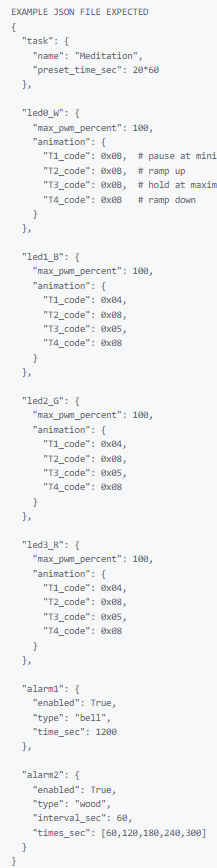
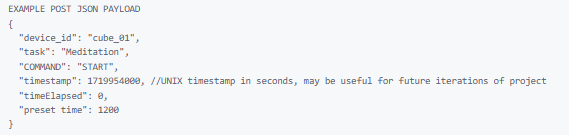

# Sprint 2 Report


---

## 1. Sprint Overview

- **Your Team Name:** [**Team 2**]  
- **Sprint 2 Dates:** [**10/02/2026 → 03/03/2026**]  
- **Sprint Goal:** 
    *Implement feature dashboard connection for timer implementation with **Firestore persistence** and **safe validation**. data should be personal to each user and users should be able to login via email.*

    *Implement basic communication between ESP32 and FLASK SERVER using REST API*


  
---

## 2. Sprint Board

**Sprint Board Link:** [**[Trello](https://trello.com/invite/b/697954d1883f9190e1c7a774/ATTIfb7fe3865b854744cbb2eac186a07e0aE569C07D/7855202610-3)**]  
**GitHub Repository Link:** [[**Github**](https://github.com/BrycesDevices/7855_202610_03.git)]

---

### 2.1 Sprint Board Screenshot (Filtered by Team Member)

**Please provide a screenshot of your Sprint 2 board** (e.g., Trello, GitHub Projects) **filtered by each team member**. This makes the review concrete and shows shared ownership.

- **[Sasha Roosen-Saba] Board Screenshot:**  
  

- **[Bryce Reid] Board Screenshot:**  
  

- **[Perry Zhuo] Board Screenshot:**  
  
- **[Kale Wyse] Board Screenshot:**  
(Repeat for each member.)

---

### 2.2 Completed vs. Not Completed (Feature-Focused)

**Plan** 
SPRINT 2:

- WEB UI FRAMEWORK PLACEHOLDERS
- COMMUNICATION PROTOCOL BETWEEN CUBE AND SERVER VIA REST API
(OR MOCK ‘CUBE’ CLIENT)
- **DATABASE FRAMEWORK** - Ability to store necessary data on firebase securely
- **Cube-Client Control** to Start, Stop session, & Reset session.
- **Web-Client Control** Configure session time, task type, and color
- **USER STORIES FOR BASIC FUNCTIONALITY** 
	- As a user i want the cube to send start,pause, and stop signals to the webapp so that the app accurately tracks how long a cube has actively run a session. 
	- As a user i want to the web app to send session time to the cube. So that session time can be easily changed.
- **END-TO-END FEATURES**
	- Web app knows how long cube has run for. 
	- Web app can send how long cube should run. 


**Completed in Sprint 2 (Feature)**

- [ ] **Client** can trigger start stops and resets. 
- [ ] **Server** exposes the endpoint with basic validation
- [ ] **Firestore** integration: data is written to the database
- [ ] **Server** can retrieve the stored data (GET from Firestore)
- [ ] **Basic Testing**: at least one test covering the happy path (or a validation test)
- [ ] **Security/Secrets**: credentials are not committed; `.gitignore` excludes sensitive files (e.g., `serviceAccountKey.json`, `.env`)

**Not Completed / Partially Completed**

- [ ] [**Feature/Task Name**]: [Brief reason: e.g., under‑estimated complexity, credential setup, blocked by Firestore rules, time constraint, ran out of Sprint]

---

## 3. Technical Summary: What Was Implemented

This is a **short technical summary** of the **end-to-end feature** you built.

- **Feature:** [**Cube Timer Control**]  
- **Collection:** [**Firestore collection**] (e.g., `features`, `orders`, etc.)  
- **What it does:** [1–2 sentence description]


### Communication between REST API on ESP32 with TEST FLASK SERVER

https://www.youtube.com/shorts/B0Q0dJrN8rY

### Defined basic JSON payload required from CUBE

TENTATIVE GET COMMAND



TENTATIVE POST COMMAND




### Data Model (Firestore)

- **Document shape:**  
  Example JSON that represents **one document** in the collection (or the schema you structured):


  **Why this structure?** We used Firebase Authentication to validate users via email. Then with unique generated uuids we store the information we need. For basica usage we store preset tasks, connected cubes, current session, and session history. 

- **Input (Client → Server):**  
  Example JSON the client sends:

  ```json
  {
    "name": "New Feature",
    "status": "pending"
  }
  ```


- **Output (Server → Client):**  
  Example response the client receives after a successful create or read:

  ```json
  {
    "id": "generated-id",
    "userId": "firebase-uid",
    "name": "New Feature",
    "status": "pending",
    "createdAt": "2026-01-01T12:00:00.000Z"
  }
  ```

---

## 4. End-to-End Flow (What Was Demoed)

Cube properly sends, and receives commands from flask server.

Give a **high-level, end-to-end description** of the feature flow you demonstrated. This is the same flow you walked through in the demo, in written form.

1. **Client** sends a request to the server (e.g., POST `/feature`) with a valid **payload** (JSON).
2. **Server** validates the input and **requires authentication** (JWT verification via Firebase Admin).
3. **Server** creates or updates a document in **Firestore**, storing it under a collection (e.g., `/features`).
4. **Client** receives a response (e.g., 201 or 200) with the stored data.
5. **Client** requests the data (e.g., GET `/feature/:id`) and the server reads the document **specifically** from Firestore.
6. **Server** returns the data to the client.

**Bounded Read:** In Sprint 2, you were required to demonstrate a **bounded read** (e.g., `.limit()`, `.where()`, or pagination). Describe what you implemented:

- **What you did:** [e.g., “We used Firestore `.limit(10)` to fetch a maximum of 10 items per request.”]
- **Why this matters:** [e.g., “This prevents unbounded scans, protects cost, and improves performance as data grows.”]

---

## 5. Sprint Retrospective: What We Learned

### 5.1 What Went Well

- [Item 1: We were able to hit our targeted goals successfully in trello]
- [Item 2: e.g., “We agreed on a consistent validation strategy for the request.”]
- [Item 3: e.g., “Our team communication and coordination improved this sprint.”]

### 5.2 What Didn’t Go Well

- [Item 1: planning was rushed, as a result documentation was a bit messy resulting in some communication errors]
- [Item 2: e.g., “Our tests were delayed and didn’t cover all edge cases by demo time.”]


### 5.3 Key Takeaways & Sprint 3 Actions

| Issue / Challenge | What We Learned | Action for Sprint 3 |
|---|---|---|
| [Rushing planning stage] | [Results in potential misuse of time implementing features that may not be required] | [spend more time ensuring architecture and documentation are done well before beginning work] |
| [Issue 2] | [Learning] | [Action] |
| [Issue 3] | [Learning] | [Action] |

---

## 6. Sprint 3 Preview

Based on what we accomplished (and what we didn’t), here are the **next Sprint 3 priorities**:
 
- [**Priority 1**: e.g., "Finalize communication between SERVER and CUBE client”]
- [**Priority 2**: e.g., “Expand testing coverage (unit + integration) and implement clearer error handling.”]
- [**Priority 3**: e.g., “Improve read performance with pagination and/or where clauses.”]
