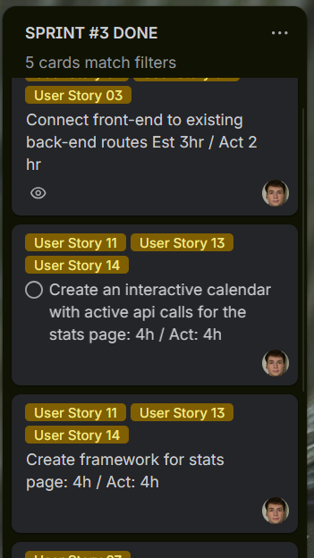

# Sprint 3 Report

- **Team Name:**  Team 3 - CUBE 
- **Sprint Dates:** 3-03-2026 → 26-03-2026  
- **Sprint Board Link:** [**[Trello](https://trello.com/invite/b/697954d1883f9190e1c7a774/ATTIfb7fe3865b854744cbb2eac186a07e0aE569C07D/7855202610-3)**]  
- **GitHub Repository Link:** [[**Github**](https://github.com/BrycesDevices/7855_202610_03.git)]

## 1. Sprint Board Screenshots
*Provide screenshots of your Sprint 3 board filtered by each team member.*
- **Perry:** 
  -   
- **Sasha:** 
  -   
- **Kale:** 
  -   
- **Bryce:** 
  -   

## 2. Sprint Review (Planned vs. Delivered)
*Review what you planned to accomplish this sprint versus what was actually completed. Focus on your architecture, testing, and UI goals.*

### Successfully Delivered:

#### Back-End Goals:
-	Remodularization 
-	Finish updating security
-	Testing 
-	Added post-hoc -  Session Storage to repository. 

Cube registration and pattern creation were cut for sprint feasibility
#### Front-End Goals:
-	Bug fixes
-	Error Handling 
-	CSR vs SSR – Explain
-	Check RGBW Hex 
#### Hardware Goals:
-	Connect to back end 

### Not Completed / Partially Completed:

#### Back-End
-	Add pattern and color management to API routes - 
-	Cube registration
#### Front-End
-   Cube registration

-	Manage Cube-IDs – Network Connection
-	Pattern management via API

We pushed the manage cube-IDs and pattern management back because the scope of work was too large to implement along side proper testing and refactorization. 

## 3. Architecture & UI Strategy
**Code Modularization:**
``` src/
    └── server/
        ├── __init__.py
        ├── blueprints/
        │   ├── __init__.py
        │   ├── api_cube/           # CUBE interface API
        │   │   ├── __init__.py
        │   │   └── routes.py
        │   ├── api_presets/        # Preset Task CRUD API
        │   │   ├── __init__.py
        │   │   └── routes.py
        │   ├── api_profile/        # User info CRUD API & CUBE registration API
        │   │   ├── __init__.py
        │   │   └── routes.py
        │   ├── api_session/        # Session related API
        │   │   ├── __init__.py
        │   │   └── routes.py
        │   ├── api_timer/          # Server-side timer API
        │   │   ├── __init__.py
        │   │   └── routes.py
        │   ├── auth/               # login, signup, logout
        │   │   ├── __init__.py
        │   │   └── routes.py
        │   ├── dashboard/          # dashboard, profile UI
        │   │   ├── __init__.py
        │   │   └── routes.py
        │   ├── presets/            # Manage user presets
        │   │   ├── __init__.py
        │   │   └── routes.py
        │   ├── sessions/           # Session logging
        │   │   ├── __init__.py
        │   │   └── routes.py
        │   └── user_info/          # Manage user information
        │       ├── __init__.py
        │       └── routes.py
        ├──  decorators/
        │   ├── __init__.py
        │   └── auth.py               # @login_required, @require_api_key
        ├── services/
        │   ├── timer_service.py      # Server-side Timer
        ├── static/
        │   ├── css/
        │   │   └──style.css
        │   └── js/                   # CSR logic
        │       ├── cube.js           # Three.js logic
        │       ├── dashboard.js      # DOM manipulation & fetching
        │       └── stats.js          # DOM manipulation & fetching
        ├── templates/                # Jinja2 HTML templates   
        │   ├── __init__.py   
        │   ├── base.html              
        │   ├── dashboard.html              
        │   ├── login.html               
        │   ├── profile.html              
        │   ├── signup.html              
        │   ├── stats.html                 
        │   └── test.html 
        └── utils/   
            ├── __init__.py   
            ├── auth.py               # Authorization helpers
            ├── repository.py         # Firestore Data Access Layer           
            └── validation.py         # Extracted input validation helpers
```
We structured the app using a modular Flask design with feature-based blueprints to separate concerns. The backend is divided into API blueprints for REST endpoints (e.g., cube, presets, sessions) and UI blueprints for rendering pages like the dashboard and authentication flows. We kept route handlers lightweight by moving business logic into a services layer (e.g., timer service), centralized authentication checks using decorators, and handled shared functionality like Firestore access and input validation in a utils layer. The frontend uses Jinja templates with static CSS and JavaScript for interactivity, resulting in a clean, scalable architecture that’s easy to maintain and test.


**SSR and CSR Breakdown**

We employ a hybrid rendering approach to optimize both initial load times and real-time interactivity.

- **Server-Side Rendering (SSR):** Flask and Jinja2 template engine are responsible for rendering the initial state of the application. This includes base layouts (base.html), authentication pages (login.html, signup.html), and the initial load of the Dashboard. For instance, the server populates the initial user task dropdown () and injects secure environment variables (like the Firebase Web API key) directly into the initial HTML payload.

- **Client-Side Rendering (CSR) & DOM Manipulation:** Highly interactive components are deferred to the client.

    - **3D Graphics:** The cube.js module utilizes Three.js to render and animate the interactive glowing cube entirely on the client's GPU.

    - **Real-time UI Updates:** dashboard.js heavily relies on CSR to manage state without page reloads. It handles asynchronous form submissions (creating/updating tasks via fetch), dynamic UI toggling (switching between task selection and the "new task" form), and ATM-style input masking for the timer.

    - **Server-Sent Events (SSE):** The timer display is updated purely via client-side DOM manipulation, listening to a continuous stream from the server (new EventSource("/task/timer")) to reflect countdowns and overtime in real-time.

## 4. Automated Testing & Coverage
- **Testing Framework:** `pytest`
- **Current Code Coverage:** [75%]
- **Mocked Components:** 
    - Client
    - Firestore
    - Firebase Auth
    - Repository Layer
    - Various API Functions

**Test Highlight:**
```python* 
# Test Demonstrates the AAA Pattern & Mocking
def test_task_control_no_current_task(client, mock_cube_request, monkeypatch):
    # Arrange
    url = "http://localhost:5000/api/task/control"
    headers = {"X-API-Key": "test-key"}
    payload = {"action": "start"}

    monkeypatch.setattr(
        "src.server.blueprints.api_cube.routes.get_current_task",
        lambda uid: None
    )

    # Act
    response = client.post(url, json=payload, headers=headers)

    # Assert
    assert response.status_code == 400
    assert response.get_json()["error"] == "Current task not set"


# Test Demonstrates Parametrization
@pytest.mark.parametrize("task_color, expected",
    [
        # Valid partition
        ("#0000ff", "#0000ffff"),
        # Valid partition 2
        ("#0000ffff", "#0000ffff"),
        # task_color None
        (None, None),
        # task_color not string
        (42, 42),
        # task_color with white spaces
        (" #0000ff ", "#0000ffff"),
        # task_color with upper case
        ("#0000FF", "#0000ffff"),
    ]
)
def test_normalize_task_color(task_color, expected):
    assert normalize_task_color(task_color) == expected